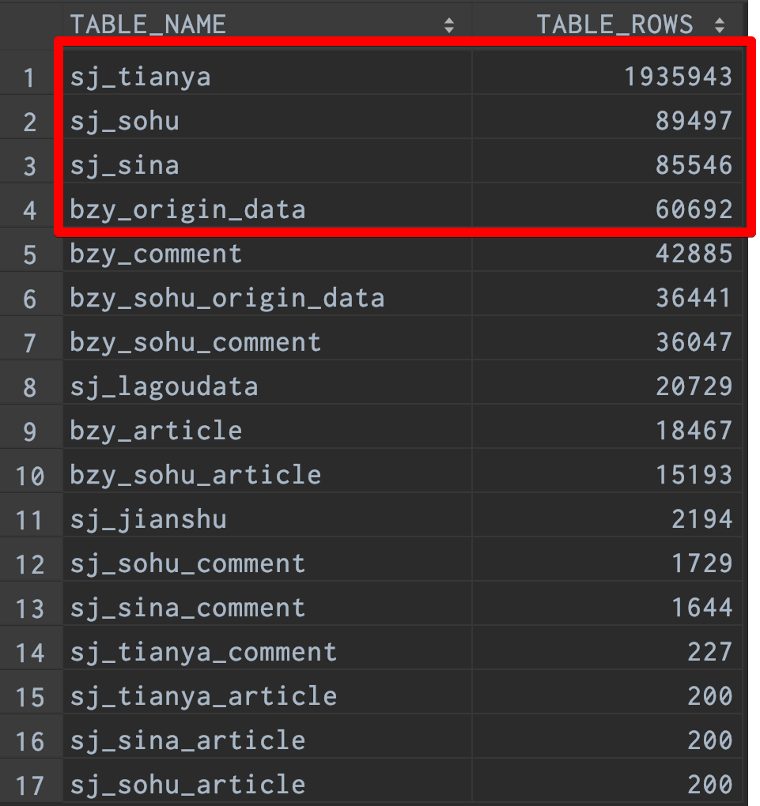

# 数据条数

```
总数据条数超过两百万条  
包含sj_tianya、sj_sohu、sj_sina、bzy_origin_data  
以上数据从网页通过爬虫、清洗处理后直接存入数据库
```
# 数据处理
```
将数据的文章内容和评论内容分开，以id对应存入数据库方便导出各种形式及后面使用
```
# 分词
```
分词过程中过滤掉文章中的无效字符，如数字、字母、符号等
分词采用jieba分词的并行分词，显著提升分词效率
```
# 构建样本集
```
1、使用Apache Flink对分完词后的文件进行词频统计，然后随机抽取样本进行标注，得到态度词文档(积极词、消极词)
2、
```
# 模型训练
```
1、SVM模型
2、神经网络
3、调参数，对比准确度
```